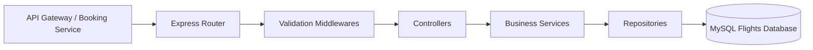
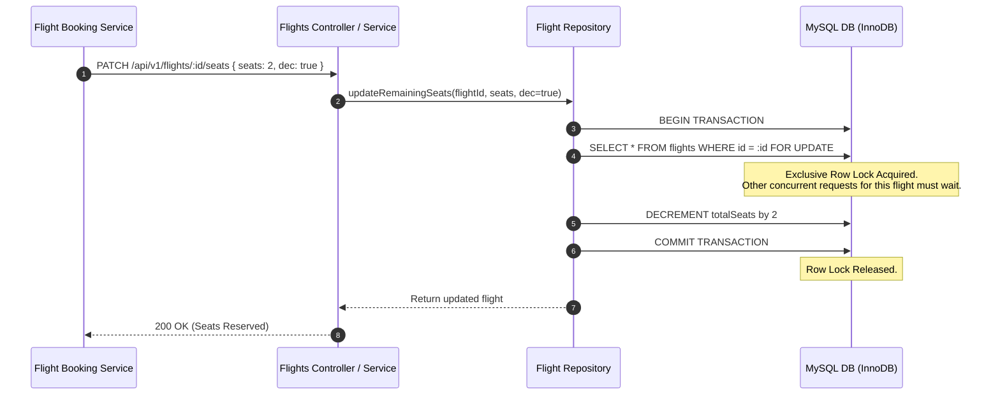
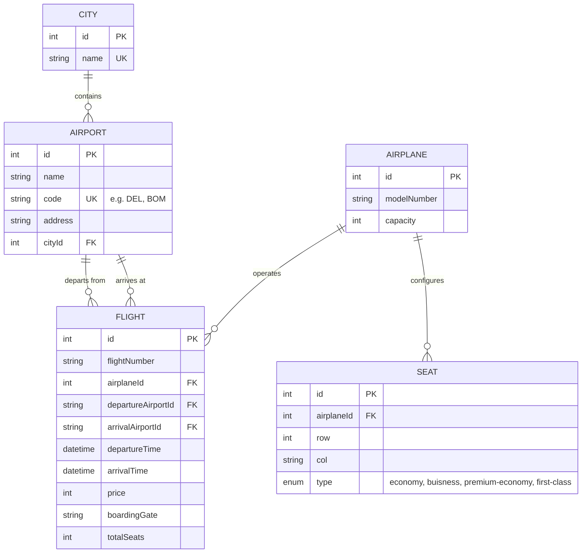

# Flights Service (`Flights-Service`)

The **Flights Service** is the core catalog and inventory engine of the Distributed Flight Service system. It manages airplanes, cities, airports, flight schedules, seat maps, and real-time seat inventory. It is engineered with **pessimistic row locking** to guarantee strict inventory consistency and eliminate overselling in high-concurrency booking environments.

---

## 1. Tech Stack & Dependencies

- **Runtime & Framework:** Node.js (v18+), Express.js (`^5.2.1`)
- **ORM & Database:** Sequelize (`^6.37.8`), `sequelize-cli` (`^6.6.5`), MySQL (`mysql2` `^3.22.5`)
- **Logging & Monitoring:** Winston (`^3.19.0`)
- **Utilities & HTTP Statuses:** `http-status-codes` (`^2.3.0`), `dotenv` (`^17.4.2`)

---

## 2. Architecture & Layered Design

The service adheres strictly to the **Controller-Service-Repository** pattern:
- **Routes (`src/routes/v1`):** Maps REST endpoints to controllers and validation middlewares.
- **Middlewares (`src/middlewares`):** Validates required payload fields, types, and time constraints before reaching business logic.
- **Controllers (`src/controllers`):** Formats HTTP requests, delegates to services, and standardizes JSON responses.
- **Services (`src/services`):** Encapsulates core business rules (e.g. `departureTime < arrivalTime`, `departureAirport != arrivalAirport`).
- **Repositories (`src/repositories`):** Executes Sequelize queries, joins, and raw SQL transaction locks.
- **Models (`src/models`):** Defines Sequelize database schemas and model associations.



---

## 3. Concurrency Control & Pessimistic Row Locking

In an airline booking system, race conditions can lead to **overbooking** if two concurrent requests attempt to reserve the last remaining seat at the exact same millisecond. 

The Flights Service prevents this using **pessimistic locking** during seat reservations:



### Implementation Detail (`flight-repository.js`)
```javascript
async updateRemainingSeats(flightId, seats, dec = true) {
  const transaction = await db.sequelize.transaction();
  try {
    // Acquire exclusive row lock
    await db.sequelize.query(`SELECT * FROM flights WHERE id = ${flightId} FOR UPDATE`);
    
    const flight = await flights.findByPk(flightId);
    if (dec == true) {
      await flight.decrement("totalSeats", { by: seats }, { transaction: transaction });
    } else {
      await flight.increment("totalSeats", { by: seats }, { transaction: transaction });
    }
    await transaction.commit();
    return flight;
  } catch(error) {
    await transaction.rollback();
    throw error;
  }
}
```

---

## 4. Database Schema & Entity Relationships



---

## 5. Environment Variables & Setup

Create a `.env` file in the root of `Flights-Service/`:

```env
PORT=3000
```

### Database Configuration (`src/config/config.json`)
```json
{
  "development": {
    "username": "root",
    "password": "your_db_password",
    "database": "Flight_Search_Dev",
    "host": "127.0.0.1",
    "dialect": "mysql"
  }
}
```

---

## 6. Complete API Route Catalog

### A. Flights API (`/api/v1/flights`)

#### 1. Search & Filter Flights
- **Method & Route:** `GET /api/v1/flights`
- **Query Parameters:**
  - `trips` (e.g. `DEL-BOM`): Departure airport code to arrival airport code.
  - `price` (e.g. `2000-8000` or `5000`): Minimum and maximum price range.
  - `travellers` (e.g. `2`): Filters flights where `totalSeats >= travellers`.
  - `tripDate` (e.g. `2026-09-26`): Date of departure.
  - `sort` (e.g. `price_ASC,departureTime_DESC`): Multi-column sorting.
- **Example Request:**
  ```http
  GET /api/v1/flights?trips=DEL-BOM&price=2000-9000&travellers=2&tripDate=2026-09-26&sort=price_ASC
  ```
- **Success Response (`200 OK`):**
  ```json
  {
    "success": true,
    "message": "Successfully completed the request",
    "data": [
      {
        "id": 1,
        "flightNumber": "AI-202",
        "airplaneId": 1,
        "departureAirportId": "DEL",
        "arrivalAirportId": "BOM",
        "departureTime": "2026-09-26T10:00:00.000Z",
        "arrivalTime": "2026-09-26T12:15:00.000Z",
        "price": 5400,
        "boardingGate": "G12",
        "totalSeats": 180,
        "airplaneDetail": {
          "id": 1,
          "modelNumber": "Airbus A320",
          "capacity": 180
        },
        "departureAirport": {
          "name": "Indira Gandhi International Airport",
          "code": "DEL",
          "City": { "name": "Delhi" }
        },
        "arrivalAirport": {
          "name": "Chhatrapati Shivaji Maharaj International Airport",
          "code": "BOM",
          "City": { "name": "Mumbai" }
        }
      }
    ],
    "error": {}
  }
  ```

---

#### 2. Get Flight by ID
- **Method & Route:** `GET /api/v1/flights/:id`
- **Success Response (`200 OK`):** Returns flight details with joined airplane and airport objects.

---

#### 3. Create Flight
- **Method & Route:** `POST /api/v1/flights`
- **Request Body:**
  ```json
  {
    "flightNumber": "6E-501",
    "airplaneId": 1,
    "departureAirportId": "DEL",
    "arrivalAirportId": "BLR",
    "departureTime": "2026-10-01T08:00:00.000Z",
    "arrivalTime": "2026-10-01T10:45:00.000Z",
    "price": 4200,
    "boardingGate": "B4",
    "totalSeats": 180
  }
  ```
- **Validation Rules:**
  - `departureTime` must be earlier than `arrivalTime`.
  - `departureAirportId` cannot be identical to `arrivalAirportId`.

---

#### 4. Update Available Seats (Inventory Modification)
- **Method & Route:** `PATCH /api/v1/flights/:id/seats`
- **Request Body:**
  ```json
  {
    "seats": 2,
    "dec": true
  }
  ```
- **Parameter Details:**
  - `seats`: Number of seats to adjust.
  - `dec`: Boolean or `1`/`0`. When `true`, seats are decremented (holding/booking). When `false`/`0`, seats are incremented (cancellation refund).

---

### B. Airplanes API (`/api/v1/airplanes`)

| Method | Endpoint | Description | Request Body Example |
|---|---|---|---|
| `POST` | `/api/v1/airplanes` | Register a new airplane | `{"modelNumber": "Boeing 737", "capacity": 189}` |
| `GET` | `/api/v1/airplanes` | Get all airplanes | None |
| `GET` | `/api/v1/airplanes/:id` | Get airplane by ID | None |
| `PATCH` | `/api/v1/airplanes/:id` | Update airplane details | `{"capacity": 195}` |
| `DELETE` | `/api/v1/airplanes/:id` | Remove airplane | None |

---

### C. Airports API (`/api/v1/airports`)

| Method | Endpoint | Description | Request Body Example |
|---|---|---|---|
| `POST` | `/api/v1/airports` | Register airport | `{"name": "Kempegowda Airport", "code": "BLR", "address": "Devanahalli", "cityId": 1}` |
| `GET` | `/api/v1/airports` | List all airports | None |
| `GET` | `/api/v1/airports/:id` | Get airport by ID | None |
| `PATCH` | `/api/v1/airports/:id` | Update airport | `{"address": "Terminal 2"}` |
| `DELETE` | `/api/v1/airports/:id` | Remove airport | None |

---

### D. Cities API (`/api/v1/cities`)

| Method | Endpoint | Description | Request Body Example |
|---|---|---|---|
| `POST` | `/api/v1/cities` | Create city | `{"name": "Bengaluru"}` |
| `PATCH` | `/api/v1/cities/:id` | Update city name | `{"name": "Bangalore"}` |
| `DELETE` | `/api/v1/cities/:id` | Delete city | None |

---

## 7. Setup & Execution

### 1. Install Dependencies
```bash
cd Flights-Service
npm install
```

### 2. Run Database Migrations
```bash
npx sequelize db:migrate
```

### 3. Start Development Server
```bash
npm run dev
```
The service starts listening on `http://localhost:3000`.
